# Data Transmission Latency SIEM Log Analysis Dashboard

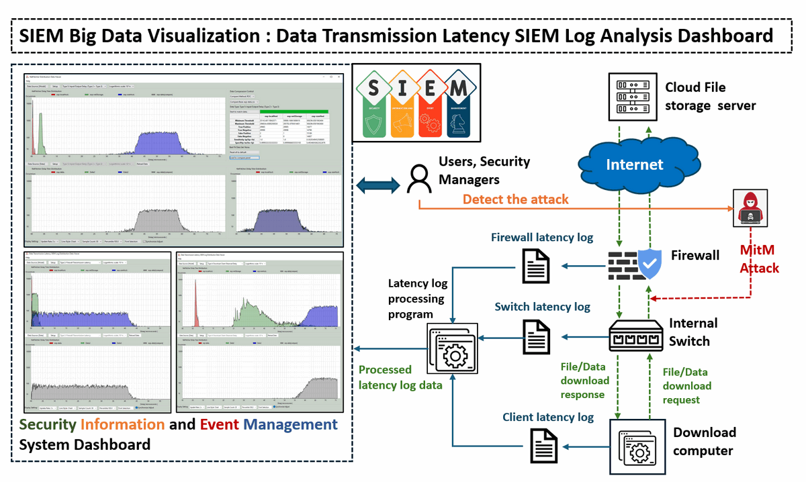

**Program Design Purpose**: The Data Transmission Latency SIEM Log Analysis Dashboard is designed to provide comprehensive visualization and analysis of file/data transmission latencies within a firewall protected company’s network, focusing on the latency between cloud, server, and individual nodes. This dashboard aggregates delay data collected from, Fortinet firewall, Cisco switches and omnibus net fetching module peer-to-peer node latency measurements. By displaying and comparing predicted latency models with real-time data, the dashboard allows for in-depth analysis using receiver operating characteristic (ROC) curve comparisons. This enables the identification of deviations in transmission latency that may signal potential network security threats, such as traffic mirroring, ARP spoofing, and Man-in-the-Middle (MITM) attacks. Through these features, the dashboard enhances situational awareness and supports proactive threat detection and mitigation in networked environments.

**The program demo video link**: https://youtu.be/YWScDiqU8tg

```python
# Version:     v0.1.2
# Created:     2024/11/01
# Copyright:   Copyright (c) 2024 LiuYuancheng
# License:     MIT License 
```

**Table of Contents**

[TOC]

- [Data Transmission Latency SIEM Log Analysis Dashboard](#data-transmission-latency-siem-log-analysis-dashboard)
    + [Introduction](#introduction)
      - [Distribution Data Viewer Dashboard Main UI](#distribution-data-viewer-dashboard-main-ui)
    + [Data Sources Detail](#data-sources-detail)
        * [Type 0: Timestamping Difference](#type-0--timestamping-difference)
        * [Type 1: Server Request Preprocessing Delay](#type-1--server-request-preprocessing-delay)
        * [Type 2: Firewall Transmission Latency](#type-2--firewall-transmission-latency)
        * [Type 3: Internal Switch Transmission Latency](#type-3--internal-switch-transmission-latency)
        * [Type 4: Download Client Observed Delay](#type-4--download-client-observed-delay)
        * [Type 5: I/O and Transfer Delay](#type-5--i-o-and-transfer-delay)
    + [System Design](#system-design)
      - [Program Main Function Design](#program-main-function-design)
    + [Program Setup](#program-setup)
        * [Development Environment : python 3.7.10](#development-environment---python-3710)
        * [Additional Lib/Software Need](#additional-lib-software-need)
        * [Hardware Needed : None](#hardware-needed---none)
        * [Program Files List](#program-files-list)
    + [Program Execution and Usage](#program-execution-and-usage)
        * [Program Data Display Selection](#program-data-display-selection)
        * [Customize Y-Axis Scale Based on View Requirement](#customize-y-axis-scale-based-on-view-requirement)
        * [Using the Program to Find the Best Match Data](#using-the-program-to-find-the-best-match-data)
        * [Program Display Configuration](#program-display-configuration)
    + [Reference Links](#reference-links)

------

### Introduction 

The **Data Transmission Latency Log Distribution Data Viewer** project aims to create a specialized dashboard application for visualizing and analyzing experimental network latency data captured by the firewall, internal switches and netFetcher module. These network devices and latency measurement module are used to record various delay metrics across different file types—ranging from small files (such as an images file with several KB ) to large files (such as Ubuntu ISO file with several GB), while downloading from multiple cloud file servers. By visualizing these data, the Distribution Latency Data Viewer will provide insights into the latency behaviors associated with different file sizes and transfer conditions.

The tool supports comprehensive visualization features, allowing users to load and plot experimental data from multiple CSV files and execute offline. Using this data, the Viewer generates distribution curves and includes a comparison functionality to help users find the best-matching data set. The key feature includes:

- **Latency Visualization**: To display the captured network latency data across various network segments, including cloud-to-router, router-to-switch, and switch-to-peer transfers. This data is sourced from `Fortinet firewall`, `internal network switches`, and the `Omnibus netFetcher` module.
- **Model vs. Real Data Comparison**: To implement a receiver operating characteristic (ROC) comparison algorithm that contrasts actual latency data with predictive model outputs. This helps in identifying abnormal data transmission patterns.
- **Anomaly Detection for Security**: By benchmarking current latency against normal patterns, the system aims to detect and alert for potential security threats such as traffic mirroring, ARP spoofing, and Man-in-the-Middle (MITM) attacks.


#### Distribution Data Viewer Dashboard Main UI

The main UI of the Distribution Data Viewer Dashboard provides two primary display modes, controlled by the `iCPMod` flag in the global configuration file `distributionViewGlobal.py`:

**Normal Parallel Display Mode**: This mode presents measured latency data at the top of the screen, with calculated values displayed at the bottom for straightforward comparison. The screen shot is shown below:

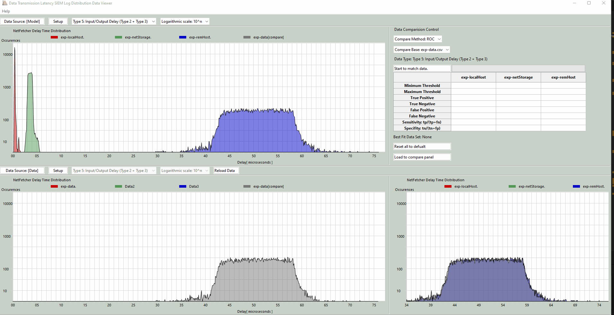

`Figure-01 Distribution Data Viewer Dashboard (normal display mode)view, version v0.1.2 (2024)`

**Compare Overlay Mode**: This mode overlays both the measured and calculated model data on a single graph, allowing for direct visual comparison of the distribution patterns. The screen shot is shown below:

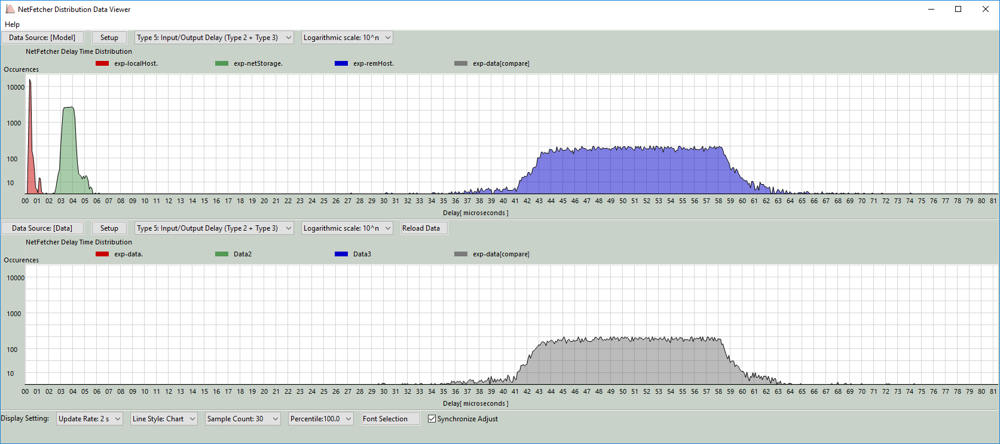

`Figure-02 Distribution Data Viewer Dashboard (compare overlay mode)view, version v0.1.2 (2024)`

 

------

### Data Sources Detail

The data for this project is collected from three critical network components: the firewall router, internal network switch, and download client node. Six types of latency metrics are gathered, each offering insights into potential network issues or security threats:

##### Type 0: Timestamping Difference

- Measures clock discrepancies across the firewall, internal switch, and download computer to ensure that all logs are synchronized to a unified time standard. This alignment is essential for accurate latency comparisons.

##### Type 1: Server Request Preprocessing Delay

- To measure server response time, we first ping the server to record an initial response time `t0`. Then, the interval `t1 − t0` is calculated by measuring the time `t1`, from sending the download request to receiving the response, yielding the server’s processing delay.
- The measurement procedure detail diagram is shown below:

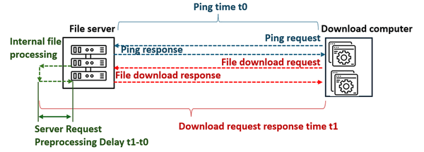

`Figure-03 Type 1: Server Request Preprocessing Delay measurement diagram, version v0.1.2 (2024)`

##### Type 2: Firewall Transmission Latency

- This captures the time taken by the firewall to process outgoing download requests and receive responses from the external server. The latency is defined as the interval `t1−t0`, where `t0` is the send time and `t1` is the receive time. A significant deviation between model predictions (normal situation) and logged values may indicate a potential MITM or traffic mirroring attack occurred between the firewall and the download server.
- The measurement procedure detail diagram is shown below:

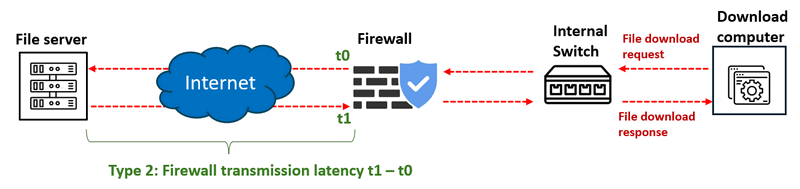

`Figure-04 Type 2: Firewall Transmission Latency measurement diagram, version v0.1.2 (2024)`

##### Type 3: Internal Switch Transmission Latency

- Measures the time taken for the internal switch to relay download requests to the firewall and receive responses back. This interval is represented as `t3−t2`. If the firewall latency (Type 2) appears normal but this metric shows anomalies, it may suggest a MITM or traffic mirroring attack between the firewall and the switch.
- The measurement procedure detail diagram is shown below:

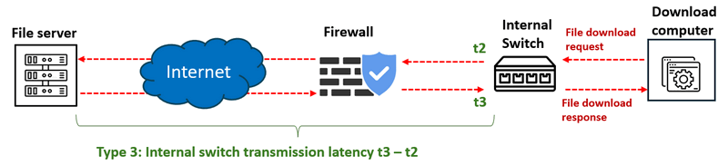

`Figure-05 Type 3: Internal Switch Transmission Latency measurement diagram, version v0.1.2 (2024)`

##### Type 4: Download Client Observed Delay

- The time interval between the client sending a request to the internal switch and receiving the response. Calculated as `t5−t4`, this metric provides insights into end-to-end delay observed at the download client. If other latencies appear stable but this metric diverges, it may indicate a MITM or traffic mirroring attack between the switch and the download node.
- The measurement procedure detail diagram is shown below:

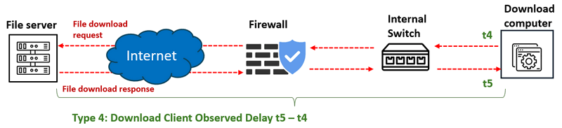

`Figure-06 Type 4: Download Client Observed Delay measurement diagram, version v0.1.2 (2024)`

##### Type 5: I/O and Transfer Delay

- This is the cumulative delay from Types 2 and 3, including additional network transfer times, providing an overall view of data transfer latency.


------

### System Design 

To visualize and analyze data transmission delays to detect potential network security issues, such as Man-in-the-Middle (MitM) attacks or traffic mirroring, we will compare the observed latency data with expected "normal" latency distributions, the system can highlight significant deviations that indicate abnormal network behavior, as shown in the diagram below: 

 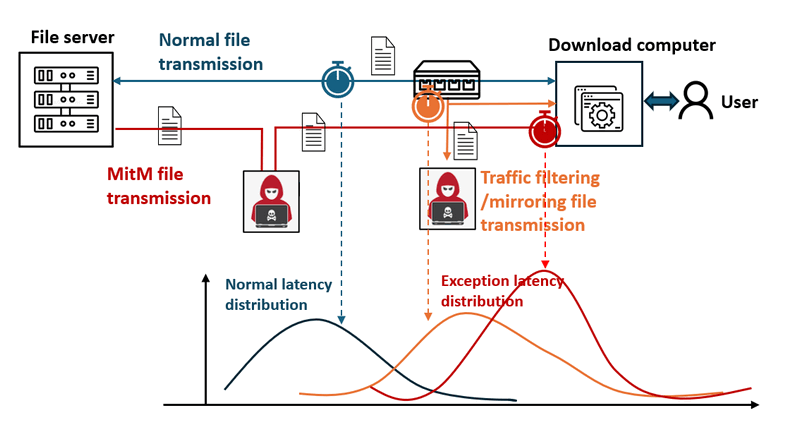

`Figure-07 Different scenario latency data distribution diagram, version v0.1.2 (2024)`

When an attack like MitM occurs, the network traffic is rerouted through an attacker’s node before reaching the user’s device, introducing a noticeable increase in transmission latency. This system aims to capture and visualize such delays to support timely detection and response. The system workflow diagram is shown below:

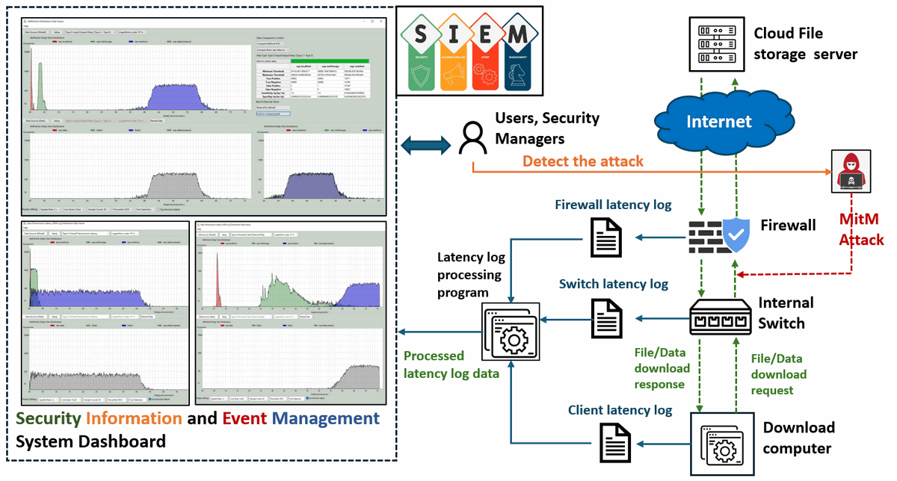

`Figure-08 System workflowdiagram, version v0.1.2 (2024)`

**Attack Scenarios and Latency Indicators:**

1. **Firewall Transmission Latency:** A significant discrepancy between the measured and expected firewall transmission latency could indicate a MitM or traffic mirroring attack between the firewall and the download server.
2. **Internal Switch Transmission Latency:** If the firewall latency distribution appears normal, but the internal switch latency shows abnormal discrepancies, this may point to a potential attack between the firewall and the switch.
3. **Download Client Observed Delay:** If both firewall and switch latencies are within normal ranges, but the client-observed latency is abnormal, this could indicate an attack between the switch and the download computer.

#### Program Main Function Design

The main functions of the latency distribution data viewer are outlined as follows:

**Dynamic Data Visualization:** The viewer dynamically updates the data view, including line styles, percentile display, and font formatting, to ensure clear presentation of latency distribution data.

**ROC-Based Data Comparison:** Using receiver operating characteristic (ROC) curve analysis, the viewer calculates and compares the current sample set’s performance metrics with the model data to determine the likelihood of attacks. This includes calculating values such as:

- **Minimum and Maximum Difference Thresholds**
- **True Positive and True Negative Rates**
- **False Positive and False Negative Rates**
- **Sensitivity**: Sensitivity = `True Positive / (True Positive+False Negative)`
- **Specificity**: Specificity = `True Negative/ (True Negative+False Positive)` 

**Overlay Graph Comparison Results:** The viewer overlays graphs of normal and current latency distributions, providing a visual representation of discrepancies. This is essential for highlighting potential anomalies caused by network attacks.


------

### Program Setup

##### Development Environment : python 3.7.10

##### Additional Lib/Software Need

1. **Wxpython 4.0x**  https://wxpython.org/pages/downloads/index.html

   ```
   Installation cmd: pip install -U wxPython
   ```

2. **Numpy**  https://pypi.org/project/numpy/

   ```
   Installation cmd: pip install numpy
   ```


##### Hardware Needed : None

##### Program Files List 

| Program File                    | Execution Env | Description                                 |
| ------------------------------- | ------------- | ------------------------------------------- |
| `src/distributionViewer.py`     | python 3      | Program UI main frame and data manager API. |
| `src/distributionViewPanel.py`  | python 3      | Function panel module.                      |
| `src/distributionViewGlobal.py` | python 3      | Global parameter file.                      |
| `src/ run.bat`                  |               | Windows auto run file.                      |
| `src/check_sripted_exp.bat`     | netfetcher    | netfetcher check config file.               |
| `src/model_scripted_exp.bat`    | netfetcher    | netfetcher model calculation config file.   |
| `src/img`                       |               | Program needed image file folder.           |
| `src/data`                      |               | Measurement data csv file storage folder.   |
| `src/model`                     |               | Modeling data csv file storage folder.      |


------

### Program Execution and Usage

To run the program, navigate to the `src` folder and execute `distributionViewer.py` by using the following command:

```bash
python distributionViewer.py
```

The tested data files in CSV format are stored in the `data` and `model` folders. The folder structure should be as follows:

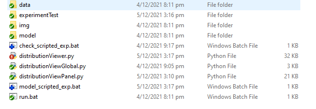

##### Program Data Display Selection

Here’s an example workflow to demonstrate how to use the program in compare mode:

**Select Data Source**

- Click the `Setup` button to select a data source from the title bar:

  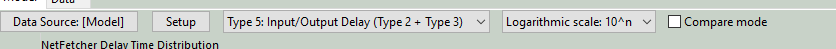

- In the data selection popup window, choose the dataset you want to display: 

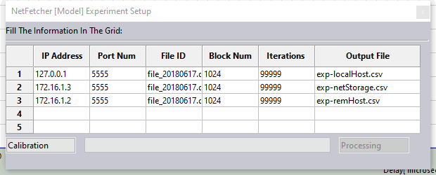

Fill in the required data and click the `Calibration` button. This will create the necessary execution configuration `.bat` file for the `netFetcher` module. Next, press the `BatchRun` button to execute `netFetcher`, and the resulting data will be stored in the `Model` and `data` folders. Once calibration is complete, the `Processing` button will change to `Finish`. Click `Finish` to proceed.

**Select Data Type to Display**

- Choose the desired data type to display from the dropdown menu, as shown in the following videos:
- video 1: https://github.com/LiuYuancheng/Distribution_Data_Viewer/blob/master/misc/Video_2019-08-22_104710.wmv
- video 2: https://github.com/LiuYuancheng/Distribution_Data_Viewer/blob/master/misc/Video_2019-08-22_105055.wmv

##### Customize Y-Axis Scale Based on View Requirement 

Select the Y-axis scale format using the dropdown menu in the title bar. The program supports three types of Y-axis scales:

| Y-Axis scale type       | Scale range               | Data covered               |
| ----------------------- | ------------------------- | -------------------------- |
| Logarithmic scale: 10^n | [1, 10, 100, 1000, 10000] | All data                   |
| Linear scale: Dynamic   | [1/10*max] *range(1, 11 ) | All data                   |
| Linear scale: Fixed     | 20*range(1,11)            | occurrences  less than 200 |

The fixed Y-axis mode is shown below:

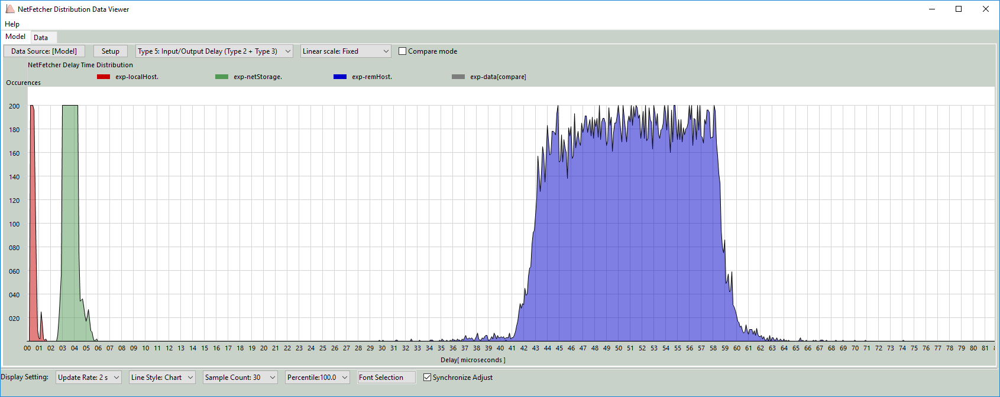

**Enable Compare Mode**

Check the `Compare Mode` box to overlay both the `[Model]` and `[data]` sets on the model display panel:

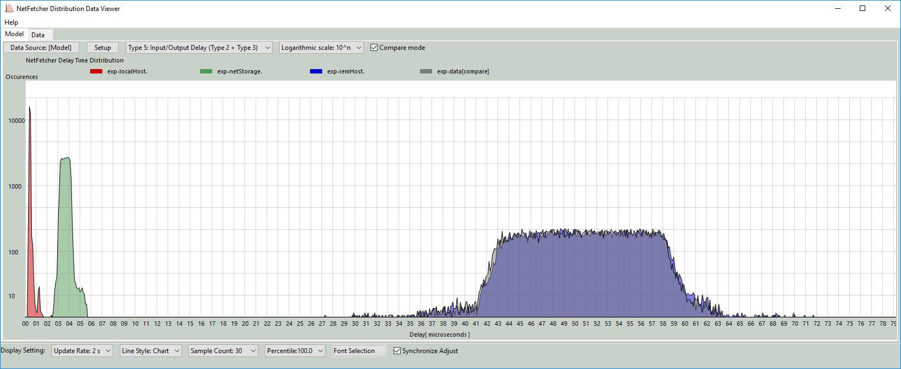


##### Using the Program to Find the Best Match Data

The ROC (Receiver Operating Characteristic) curve comparison tool helps find the best matching data between two sets:

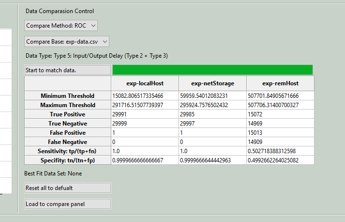

**Select Comparison Method**

- In the data comparison control panel, choose the comparison method (currently, only one method is available for comparing ROC curves between two datasets).
- [Learn more about ROC Comparison](https://ncss-wpengine.netdna-ssl.com/wp-content/themes/ncss/pdf/Procedures/NCSS/Comparing_Two_ROC_Curves-Paired_Design.pdf)

**Select Base Data**

- Choose the base data set for comparison from the dropdown menu.

**Start Data Matching**

- Click the `Start to match data` button to calculate ROC values and find the optimal sensitivity. A summary of the results will appear in a table, showing key metrics like minimum and maximum thresholds, true positive and negative rates, false positives and negatives, sensitivity, and specificity, as illustrated below:

```
Minimum Threshold: 19631.183700649814
Maximum Threshold: 19631.183700649814
True Positive: 28803
True Negative: 16668
False Positive: 11575
False Negative: 1055
Sensitivity: tp/(tp+fn) = 0.9646660861410677
Specifity: tn/(tn+fp) = 0.5901639344262295
```

**Load to Compare Panel**

- Click `Load to compare panel` to overlay the best matching data with the base data on the comparison panel:

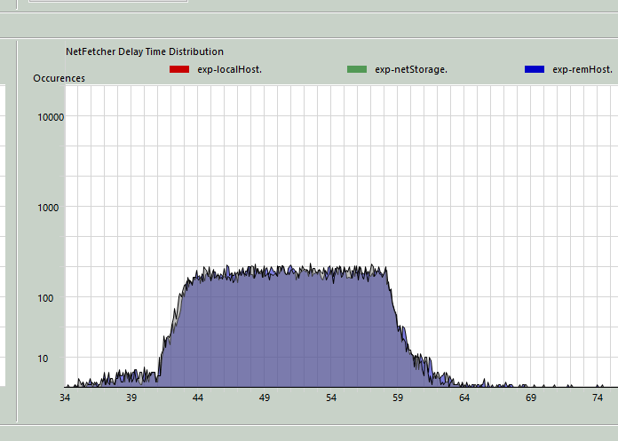


##### Program Display Configuration

- The user can adjust display settings in the display configuration bar:

  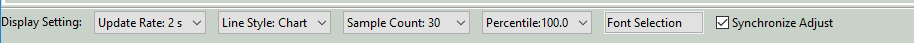

- Data display rate can be set between 2 to 5 seconds, and the sampling count and data percentile can also be adjusted from the dropdown menu.

- Click the `Font Selection` button to open the font settings window:

  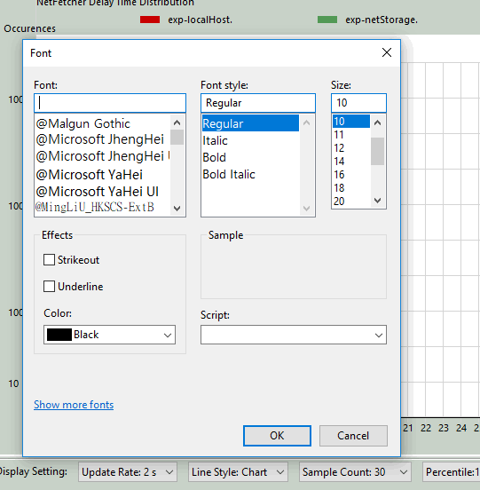

- Check the `Synchronized Adjust` option to apply the same settings across both `[Model]` and `[data]` displays simultaneously.


------

### Reference Links

- https://github.com/chef/omnibus/blob/main/lib/omnibus/fetchers/net_fetcher.rb

------

> Last edit by LiuYuancheng(liu_yuan_cheng@hotmail.com) at 02/11/2024,  if you have any problem, please send me a message. 

