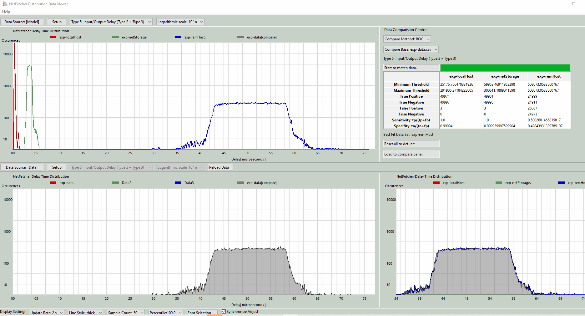

# Distribution_Data_Viewer

**Program Design Purpose**: We have collected some distribute delay(time interval) data when using the **[ omnibus](https://github.com/chef/omnibus)** netFetcher module to query big data from client computer from the server.  We want to visualized these different kinds of delay data, do graph comparison between the model prediction and real data with the receiver operating characteristic curve compare algorithm.

[TOC]


### Introduction 

This project will create a distribution data viewer to visualize the experiment result of the netFetcher. The netFetcher will record different kinds of delay when loading big files (such as the Ubuntu ISO img) from different servers. The distribution viewer will load all the experiment CSV files and create the related distribution curves. The distribution viewer program will also provide a comparison function to find the best match data and display the compare result with the receiver operating characteristic(ROC) curve compare algorithm.


#### Distribution Data Viewer Main UI

The user can select **normal parallel display mode** and **compare overlay mode** by change the `iCPMod` flag in the globale file`distributionViewGlobal.py` . The compare mode Main UI is shown below:



**Normal parallel display mode** will show the netFetcher module measured data at the top panel and show the the calculated data at the bottom panel:


**Compare overlay mode** will overly the module measured data and self calculated data in one graph: 


version: v_0.2

#### Program Main Function

The main function of the Viewer 

1. Visualize different kinds of delay data with different data sampling rate. 

   | The data viewer will show 6 types of file transfer delay data which collected by the netFetcher program: |
   | ------------------------------------------------------------ |
   | Type 0: Timestamping Delay [Time clock delay/difference between server and client.] |
   | Type 1: Download Server Request Preprocessing Delay          |
   | Type 2: Download Server Disk Seek Delay                      |
   | Type 3: Download Server Disk Read Delay                      |
   | Type 4: Client Observed Delay (Time[get the download package] - Time[send the download request] ) |
   | Type 5:I/O+transfer Delay (Type 2 + Type 3 + Network delay)  |

2. Dynamically update the data view, line style, percentile of data, font format. 
3. Calculate the current model and measured data sample set's ROC comparison value for different three kinds of data set : `data minimum diference threshold` ,  `data maximum difference threshold` , `model match to measurement true positive rate` , `model match to measurement true negative rate` , `model match to measurement false positive rate`, `model match to measurement false negative rate`, `sensitivity [true positive/(true positive+false negative)]` , `specifity [true negative/(true negative + false positive)]`

4. Show the overly graph comparison result. 
5. --


------

### Program Setup

###### Development Environment : python 3.7.10

###### Additional Lib/Software Need

1. **Wxpython 4.0x**  https://wxpython.org/pages/downloads/index.html

   ```
   Installation cmd: pip install -U wxPython
   ```

2. **Numpy**  https://pypi.org/project/numpy/

   ```
   Installation cmd: pip install numpy
   ```

3. -- 

###### Hardware Needed : None

###### Program Files List 

version: V_0.2

| Program File                  | Execution Env | Description                                 |
| ----------------------------- | ------------- | ------------------------------------------- |
| src/distributionViewer.py     | python 3      | Program UI main frame and data manager API. |
| src/distributionViewGlobal.py | python 3      | Function panel module.                      |
| src/distributionViewGlobal.py | python 3      | Global parameter file.                      |
| src/ run.bat                  |               | Windows auto run file.                      |
| src/check_sripted_exp.bat     | netfetcher    | netfetcher check config file.               |
| src/model_scripted_exp.bat    | netfetcher    | netfetcher model calculation config file.   |
| src/img                       |               | Program needed image file folder.           |
| src/data                      |               | Measurement data csv file storage folder.   |
| src/model                     |               | Modeling data csv file storage folder.      |


------

### Program Usage

###### Program Execution 

To run the program, go/cd to the src folder and run the "distributionViewer.py" program by:

```
python distributionViewer.py
```

The tested data CSV files are in the '`data`' and '`model`' folder, the folder structure should be:


###### Program Data Display Selection

We use the compare mode as an example to show how to use the program: 

1. Click `setup` button to select data source from the title bar: 

   

   Select the data set you want to display in the data set selection popup window: 

   

   Fill in the data and click the "`Calibration`" button, then the related netFetcher execution configuration *.bat file will be created, then press the "BatchRun" button the netFetcher program will be executed and the related data will be put in "Model" and "data" folder. When the data calibration finished the `processing` button will change to `finish`, then press the `finish` button. 

2. Select the date type you want to display in the drop down menu as shown in the video: 

   https://github.com/LiuYuancheng/Distribution_Data_Viewer/blob/master/misc/Video_2019-08-22_104710.wmv
   
   https://github.com/LiuYuancheng/Distribution_Data_Viewer/blob/master/misc/Video_2019-08-22_105055.wmv
   
3. Select display different type of data and the Y-Axis scale format with the drop down menu in the title bar. Currently we provide 3 kinds of Y-Axis scale: 

   | Y-Axis scale type       | Scale range               | Data covered               |
   | ----------------------- | ------------------------- | -------------------------- |
   | Logarithmic scale: 10^n | [1, 10, 100, 1000, 10000] | All data                   |
   | Linear scale: Dynamic   | [1/10*max] *range(1, 11 ) | All data                   |
   | Linear scale: Fixed     | 20*range(1,11)            | occurrences  less than 200 |

   The fixed Y-Axis mode is shown below:

   


3. Click the "compare mode" check box, both the [Model] and [data] data will be drawn overlay on the model display panel: 

   

4. -- 


###### Program Display Config Selection 

- The user can change the display setting in the button display setting bar: 

- The mode data display rate can be change in 2sec ~ 5 sec. The program will sample count and data percentile can also be changed from the drop down menu. 

- Press the "`Font Selection`" button the font change window will pop-up: 

  

- Check the "Synchronized Adjust" check box the [model] and [data] display will show the same change when user change one of the data display selection setting. 


###### Use Program to Find The Best Match Data

This is the receiver operating characteristic curve compare algorithm control panel used to find the best match data: 


**Step 1**: In the data comparison control panel, select the compare method: (Currently only have one compare method which compare 2 curve's ROC )

ROC compare doc link: https://ncss-wpengine.netdna-ssl.com/wp-content/themes/ncss/pdf/Procedures/NCSS/Comparing_Two_ROC_Curves-Paired_Design.pdf

**Step 2**: Select the compare base data from the drop down menu.

**Step 3**: Click the "Start to match data" button, the program will start to calculate the data's ROC and find the best sensitivity data. The orignal data will be shown in the table. 

```
Minimum Threshold: 19631.183700649814
Maximum Threshold: 19631.183700649814
True Positive: 28803
True Negative: 16668
False Positive: 11575
False Negative: 1055
Sensitivity: tp/(tp+fn) = 0.9646660861410677
Specifity: tn/(tn+fp) = 0.5901639344262295
Minimum Threshold: 209266.451635113
Maximum Threshold: 209279.2085214074        
True Positive: 14964
True Negative: 15120
False Positive: 14878
False Negative: 15030
Sensitivity: tp/(tp+fn) = 0.4988997799559912
Specifity: tn/(tn+fp) = 0.5040336022401494  
```

**Step 4**: Click the "Load to compare panel"  button, the best match data and the compare base data will be plot overlay with each other on the compare panel as shown below: 


**Step 5:**  -- 


------

### Problem and Solution

###### Problem: 

**OS Platform** : 

**Error Message**: 

**Type**: 

**Solution**:

**Related Reference**:  


------

### Reference Links

- https://ncss-wpengine.netdna-ssl.com/wp-content/themes/ncss/pdf/Procedures/NCSS/Comparing_Two_ROC_Curves-Paired_Design.pdf
- https://github.com/chef/omnibus/blob/main/lib/omnibus/fetchers/net_fetcher.rb
- 

------

> Last edit by LiuYuancheng(liu_yuan_cheng@hotmail.com) at 05/12/2021

